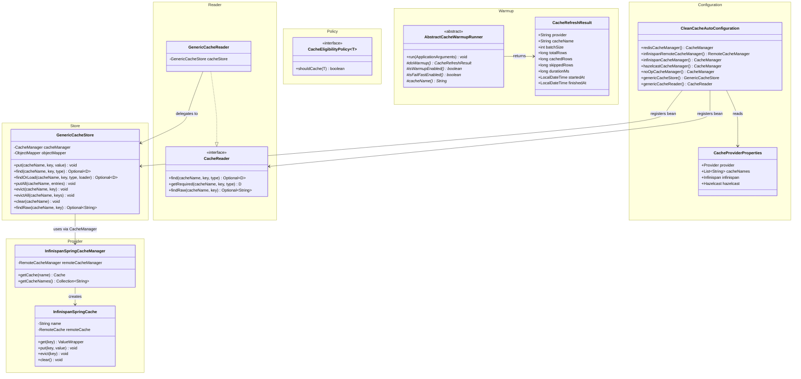

# clean-common-cache

**Group:** `com.clean` | **Artifact:** `clean-common-cache` | **Version:** `0.0.1-SNAPSHOT`

     

---

## Description

`clean-common-cache` is a **provider-agnostic, type-safe cache java-library** for the Clean Architecture microservices monorepo. It abstracts Infinispan, Redis, Hazelcast, and NoOp behind a unified `GenericCacheStore` and `CacheReader` interface, so API modules can perform cache operations with zero provider lock-in and minimal boilerplate.

> Persistence and service layer patterns live in [`clean-common-jpa`](../clean-common-jpa/README.md).
> `clean-common-cache` is a pure cache abstraction library — it has no awareness of domain entities or JPA.

### What it provides

| Category | Components |
|----------|-----------|
| Store | `GenericCacheStore` — type-safe JSON put/find/findOrLoad/putAll/evict/evictAll/clear |
| Reader | `CacheReader`, `GenericCacheReader` — read-only ISP interface |
| Policy | `CacheEligibilityPolicy<T>` — strategy interface for entry acceptance rules |
| Warmup | `AbstractCacheWarmupRunner`, `CacheRefreshResult` — template for startup cache warming |
| Provider | `InfinispanSpringCacheManager`, `InfinispanSpringCache` — Infinispan Hot Rod adapter |
| Configuration | `CacheProviderProperties` — `clean.cache.provider` = INFINISPAN \| REDIS \| HAZELCAST \| NONE |
| Auto-config | `CleanCacheAutoConfiguration` — wires CacheManager + GenericCacheStore + CacheReader |
| Exception | `MissingCacheValueException` — thrown by `getRequired` on cache miss |

> **Spring Boot auto-configuration included.** `CleanCacheAutoConfiguration` is registered via `AutoConfiguration.imports` and activates automatically when the library is on the classpath.

---

## Tech Stack

| Item | Version |
|------|---------|
| Java | 21 (Temurin 21.0.9) |
| Gradle | 8.8 (Groovy DSL) |
| Spring Boot BOM | 3.5.x |
| Spring Data Redis | via BOM |
| Infinispan Hot Rod | 15.2.0.Final |
| Hazelcast Spring | 5.5.0 |
| Lombok | 1.18.36 |
| Jackson | via BOM |

---

## Build & Publish

> **Prerequisite:** Run `j21` before any Gradle command to activate the Java 21 runtime.

```bash
j21
cd /path/to/clean-common-cache
./gradlew clean build publishToMavenLocal
```

Published artifact location:

```
~/.m2/repository/com/clean/clean-common-cache/0.0.1-SNAPSHOT/
```

---

## Add as Dependency

In your consumer module's `build.gradle`:

```groovy
repositories {
    mavenLocal()
    mavenCentral()
}

dependencies {
    implementation 'com.clean:clean-common-cache:0.0.1-SNAPSHOT'
}
```

---

## How to Use the Library

### 1. Configuration

Set the cache provider and cache names in your `application.properties` (or `.yml`):

```properties
# Provider: INFINISPAN (default) | REDIS | HAZELCAST | NONE
clean.cache.provider=infinispan

# Cache names to pre-register with the CacheManager
clean.cache.cache-names=config-cache,user-cache

# Infinispan
clean.cache.infinispan.server-list=127.0.0.1:11222
clean.cache.infinispan.username=infinispan
clean.cache.infinispan.password=secret

# Redis
clean.cache.redis.default-ttl-seconds=3600
clean.cache.redis.cache-configs.config-cache.ttl-seconds=1800
clean.cache.redis.cache-configs.user-cache.ttl-seconds=600

# Hazelcast
clean.cache.hazelcast.cluster-name=dev
clean.cache.hazelcast.server-addresses=127.0.0.1:5701
```

---

### 2. Provider Details

#### Infinispan (default)

Infinispan is the default provider (`clean.cache.provider=infinispan` or when the property is omitted).

**How it works:**

- `CleanCacheAutoConfiguration` creates a `RemoteCacheManager` using the Hot Rod client library.
- The connection is **lazy** — `RemoteCacheManager` is constructed with `started=false`, so no network connection is attempted at startup. The first `getCache(name)` call triggers the actual Hot Rod handshake.
- `InfinispanSpringCacheManager` wraps `RemoteCacheManager` and adapts it to Spring's `CacheManager` interface.
- Each cache name resolves to an `InfinispanSpringCache`, which wraps a `RemoteCache<Object, Object>`.
- Values stored via `GenericCacheStore` are **JSON strings** — serialized by Jackson before being handed to `RemoteCache.put()`.
- Caches must be **pre-created on the Infinispan server** (e.g., via a K8s Job or Infinispan console). If a cache name does not exist on the server, `getCache()` throws `IllegalStateException` with a descriptive message.
- Authentication is optional — credentials are only applied when both `username` and `password` are non-blank.

**Infinispan-specific properties:**

| Property | Default | Description |
|----------|---------|-------------|
| `clean.cache.infinispan.server-list` | `127.0.0.1:11222` | Hot Rod endpoint(s), comma-separated |
| `clean.cache.infinispan.username` | `infinispan` | Hot Rod auth username (omit or leave blank to skip auth) |
| `clean.cache.infinispan.password` | _(none)_ | Hot Rod auth password |

**Example:**

```properties
clean.cache.provider=infinispan
clean.cache.cache-names=config-cache,user-cache
clean.cache.infinispan.server-list=infinispan-svc:11222
clean.cache.infinispan.username=appuser
clean.cache.infinispan.password=s3cret
```

> **Infrastructure prerequisite:** The named caches (`config-cache`, `user-cache`) must exist on the Infinispan server before the application starts. They are not auto-created by the library.

---

#### Redis

Redis uses **Spring Data Redis** under the hood — the library configures `RedisCacheManager` on top of the auto-detected `RedisConnectionFactory`.

**How it works:**

- Spring Boot auto-configures a `RedisConnectionFactory` from `spring.redis.*` (or `spring.data.redis.*`) properties. The library does not manage the connection factory itself.
- `CleanCacheAutoConfiguration` builds a `RedisCacheManager` using the connection factory and the TTL settings from `CacheProviderProperties.Redis`.
- Both keys and values are serialized as **plain strings** (`StringRedisSerializer`) — consistent with the JSON-string model used by `GenericCacheStore`.
- A **default TTL** applies to all caches; individual caches can override the TTL via `cache-configs`.
- Null values are rejected (`disableCachingNullValues()`).
- If `clean.cache.cache-names` is set, those caches are pre-registered in the manager at startup.

**Redis-specific properties:**

| Property | Default | Description |
|----------|---------|-------------|
| `clean.cache.redis.default-ttl-seconds` | `3600` | Default TTL for all caches (seconds) |
| `clean.cache.redis.cache-configs.<name>.ttl-seconds` | _(uses default)_ | Per-cache TTL override |

**Spring Data Redis connection** (managed by Spring Boot, not this library):

```properties
spring.data.redis.host=localhost
spring.data.redis.port=6379
spring.data.redis.password=secret       # optional
spring.data.redis.ssl.enabled=false     # optional
```

**Example:**

```properties
clean.cache.provider=redis
clean.cache.cache-names=config-cache,user-cache

# Global TTL fallback
clean.cache.redis.default-ttl-seconds=3600

# Per-cache overrides
clean.cache.redis.cache-configs.config-cache.ttl-seconds=1800
clean.cache.redis.cache-configs.user-cache.ttl-seconds=300

# Spring Boot Redis connection
spring.data.redis.host=redis-svc
spring.data.redis.port=6379
```

> **Infrastructure prerequisite:** A running Redis instance is required. Spring Boot will fail to start if the `RedisConnectionFactory` cannot be created (e.g., missing `spring-boot-starter-data-redis` dependency).

---

### 3. GenericCacheStore — Write & Read

Inject `GenericCacheStore` when a component needs full read/write/eviction access:

```java
@Service
@RequiredArgsConstructor
public class ConfigCacheStore {

    private final GenericCacheStore genericCacheStore;

    public void put(String key, ConfigDTO dto) {
        genericCacheStore.put("config-cache", key, dto);
    }

    public Optional<ConfigDTO> find(String key) {
        return genericCacheStore.find("config-cache", key, ConfigDTO.class);
    }

    public Optional<ConfigDTO> findOrLoad(String key, Supplier<Optional<ConfigDTO>> loader) {
        return genericCacheStore.findOrLoad("config-cache", key, ConfigDTO.class, loader);
    }

    public void evict(String key) {
        genericCacheStore.evict("config-cache", key);
    }

    public void clear() {
        genericCacheStore.clear("config-cache");
    }
}
```

---

### 4. CacheReader — Read-Only Access

Inject `CacheReader` when a component only needs to read — enforces ISP:

```java
@Service
@RequiredArgsConstructor
public class ConfigQueryService {

    private final CacheReader cacheReader;

    public Optional<ConfigDTO> find(String key) {
        return cacheReader.find("config-cache", key, ConfigDTO.class);
    }

    public ConfigDTO getRequired(String key) {
        // Throws MissingCacheValueException if absent
        return cacheReader.getRequired("config-cache", key, ConfigDTO.class);
    }

    public Optional<String> findRaw(String key) {
        return cacheReader.findRaw("config-cache", key);
    }
}
```

---

### 5. CacheEligibilityPolicy — Entry Acceptance Strategy

Implement `CacheEligibilityPolicy<T>` to apply business rules before storing entries:

```java
@Component
public class ConfigCachePolicy implements CacheEligibilityPolicy<ConfigDTO> {

    @Override
    public boolean shouldCache(ConfigDTO entry) {
        return entry != null
            && entry.getValue() != null
            && !entry.isSensitive();
    }
}
```

Use it in your domain cache store:

```java
public void put(String key, ConfigDTO dto) {
    if (policy.shouldCache(dto)) {
        genericCacheStore.put("config-cache", key, dto);
    }
}
```

---

### 6. AbstractCacheWarmupRunner — Startup Cache Warming

Extend `AbstractCacheWarmupRunner` to pre-populate a cache at application startup:

```java
@Component
public class ConfigCacheWarmupRunner extends AbstractCacheWarmupRunner {

    private final ConfigCacheStore configCacheStore;
    private final ConfigRepository configRepository;

    @Value("${clean.cache.warmup.enabled:true}")
    private boolean warmupEnabled;

    @Value("${clean.cache.warmup.fail-fast:false}")
    private boolean failFast;

    @Override
    protected CacheRefreshResult doWarmup() {
        LocalDateTime start = LocalDateTime.now();
        long startMs = System.currentTimeMillis();

        List<ConfigEntity> all = configRepository.findAll();
        long cached = 0;
        for (ConfigEntity entity : all) {
            ConfigDTO dto = mapper.toDto(entity);
            configCacheStore.put(entity.getKey(), dto);
            cached++;
        }

        return CacheRefreshResult.builder()
            .cacheName("config-cache")
            .totalRows(all.size())
            .cachedRows(cached)
            .skippedRows(all.size() - cached)
            .durationMs(System.currentTimeMillis() - startMs)
            .startedAt(start)
            .finishedAt(LocalDateTime.now())
            .build();
    }

    @Override protected boolean isWarmupEnabled() { return warmupEnabled; }
    @Override protected boolean isFailFastEnabled() { return failFast; }
    @Override protected String cacheName() { return "config-cache"; }
}
```

**Fail-fast mode:** When `isFailFastEnabled()` returns `true`, warmup failures throw `IllegalStateException` and prevent application startup. When disabled, failures are logged and the app starts in degraded mode.

---

## Package Structure

```
com.clean.common.cache
├── autoconfigure
│   └── CleanCacheAutoConfiguration      (Spring Boot auto-configuration)
├── exception
│   └── MissingCacheValueException        (RuntimeException — thrown on required cache miss)
├── policy
│   └── CacheEligibilityPolicy<T>         (strategy interface — entry acceptance rules)
├── properties
│   └── CacheProviderProperties           (clean.cache.* config properties)
├── provider
│   ├── InfinispanSpringCacheManager      (Spring CacheManager for Infinispan Hot Rod)
│   └── InfinispanSpringCache             (Spring Cache adapter for RemoteCache)
├── reader
│   ├── CacheReader                       (read-only interface — ISP)
│   └── GenericCacheReader                (delegates to GenericCacheStore)
├── store
│   └── GenericCacheStore                 (type-safe JSON cache store — all providers)
└── warmup
    ├── AbstractCacheWarmupRunner         (Template Method — startup warmup base)
    └── CacheRefreshResult                (metrics DTO for warmup/refresh operations)
```

---

## Class Diagram



---

## Key Design Decisions

| Decision | Rationale |
|----------|-----------|
| Provider abstraction via `CacheManager` | `GenericCacheStore` delegates provider selection entirely to Spring's `CacheManager` — swapping Infinispan → Redis → Hazelcast requires only a config property change, no code change |
| JSON serialization (String values) | All cache values are serialized to JSON strings — provider-neutral, human-readable, and compatible with all cache backends without custom serializer configuration |
| Interface segregation — `CacheReader` / `GenericCacheStore` | Components that only read from cache inject `CacheReader`; only components with write responsibility inject `GenericCacheStore` — enforces ISP |
| `CacheEligibilityPolicy<T>` strategy | Domain modules implement their own acceptance rules without modifying store infrastructure — OCP compliant, Strategy pattern |
| `AbstractCacheWarmupRunner` template | Common startup lifecycle, logging, and fail-fast error handling are provided by the base; subclasses only implement `doWarmup()` — Template Method pattern |
| `@ConditionalOnMissingBean` throughout | Consuming modules can override any bean (CacheManager, ObjectMapper, GenericCacheStore) by declaring their own — prevents configuration conflict |
| Lazy Infinispan start (`false` flag) | `RemoteCacheManager` is created with `started=false` — connection is deferred until the first cache operation, avoiding startup failures when the Infinispan server is unavailable |
| `clean.cache.provider=NONE` | Disables all caching via `NoOpCacheManager` — useful in test environments or when cache infrastructure is not provisioned |
| Corrupt entry auto-eviction | `GenericCacheStore.find` evicts and returns empty on `JsonProcessingException` — prevents a stale/corrupt entry from poisoning repeated reads |
