# clean-common-jpa

**Group:** `com.clean` | **Artifact:** `clean-common-jpa` | **Version:** `0.0.1-SNAPSHOT`

    

---

## Description

`clean-common-jpa` is a **foundational JPA/Spring Data java-library** for the Clean Architecture microservices monorepo. It provides all reusable base classes, interfaces, utilities, and patterns so that API modules can be scaffolded with zero architectural drift and minimal boilerplate.

> HTTP envelope DTOs and base controllers live in [`clean-common-web`](../clean-common-web/README.md).
> `clean-common-jpa` is a pure persistence and service layer library.

### What it provides

| Category | Components |
|----------|-----------|
| Entity | `BaseEntity` — audited, soft-delete enabled |
| DTO | `BaseDTO`, `PageDTO`, `PageMetaDTO`, `PageQueryDTO`, `SortOrderDTO`, `SortDirection` |
| Mapper | `ReadMapper`, `WriteMapper`, `BaseMapper` — MapStruct interface segregation |
| Repository | `BaseJpaRepository` — JpaRepository + JpaSpecificationExecutor |
| Service | `ReadService`, `CrudService`, `BaseJpaReadService`, `BaseJpaCrudService` |
| Query API | `QueryBuilder` — immutable fluent API for filter / search / projection |
| Filtering | `FilterSpecificationUtil`, `ExactFilterStrategy`, `LikeFilterStrategy` |
| Pagination | `PageableUtil`, `PaginationRequest`, `PageDTO`, `PageMetaDTO` |
| Constants | `QueryMode` (SEARCH / FILTER), `SortDirection` (ASC / DESC) |
| Exceptions | `ColumnValidationException` |

> **No Spring Boot auto-configuration.** This is a pure library — consumers depend on it via `mavenLocal` and extend/implement the provided base classes.

---

## Tech Stack

| Item | Version |
|------|---------|
| Java | 21 (Temurin 21.0.9) |
| Gradle | 8.8 (Groovy DSL) |
| Spring Boot BOM | 3.5.x |
| Spring Data JPA | via BOM |
| MapStruct | 1.6.3 |
| Lombok | 1.18.36 |
| Jackson | via BOM |
| Jakarta Persistence API | via BOM |
| Jakarta Validation API | via BOM |

---

## Build & Publish

> **Prerequisite:** Run `j21` before any Gradle command to activate the Java 21 runtime.

```bash
j21
cd /path/to/clean-common-jpa
./gradlew clean build publishToMavenLocal
```

Published artifact location:

```
~/.m2/repository/com/clean/clean-common-jpa/0.0.1-SNAPSHOT/
```

---

## Run Tests

```bash
j21
./gradlew test
```

Test coverage includes:

| Test Class | Coverage |
|-----------|----------|
| `BaseJpaReadServiceBatchTest` | Batch read operations, cursor-based iteration |
| `PageDTOTest` | Pagination DTO construction from Spring `Page<T>` |
| `PageableUtilTest` | 1-based → 0-based page conversion, size capping |
| `FilterSpecificationUtilTest` | Exact equality and LIKE specification building |

---

## Add as Dependency

In your consumer module's `build.gradle`:

```groovy
repositories {
    mavenLocal()
    mavenCentral()
}

dependencies {
    implementation 'com.clean:clean-common-jpa:0.0.1-SNAPSHOT'
}
```

---

## How to Use the Library

### 1. Entity

Extend `BaseEntity`. It provides: `id`, `createdOn`, `createdBy`, `updatedOn`, `updatedBy`, `deleted` (soft-delete).

```java
@Entity
@Table(name = "tbl_clean_product")
@SuperBuilder
@NoArgsConstructor
@AllArgsConstructor
public class ProductEntity extends BaseEntity {
    @Column(name = "name", length = 255)
    private String name;

    @Column(name = "price")
    private BigDecimal price;
}
```

- Always use `@SuperBuilder` (not `@Builder`) on entities that extend `BaseEntity`
- Soft-delete is automatic — `@SQLRestriction("deleted = false")` filters deleted records from all queries

---

### 2. DTO

Extend `BaseDTO`. It carries: `id`, `createdOn`, `createdBy`, `updatedOn`, `updatedBy`.

```java
@SuperBuilder
@JsonInclude(JsonInclude.Include.NON_NULL)
public class ProductDTO extends BaseDTO implements Serializable {
    private String name;
    private BigDecimal price;
}
```

---

### 3. Mapper

Extend `BaseMapper<E, D>` (combines `ReadMapper` + `WriteMapper`).

```java
@Mapper(componentModel = "spring")
public interface ProductMapper extends BaseMapper<ProductEntity, ProductDTO> {
    // toDto(), toEntity(), updateEntity() inherited
}
```

---

### 4. Repository

Extend `BaseJpaRepository<E, ID>`.

```java
@Repository
public interface ProductRepository extends BaseJpaRepository<ProductEntity, Long> {
    // JpaRepository + JpaSpecificationExecutor included
}
```

---

### 5. Service — Read-Only

Extend `BaseJpaReadService<E, ID, D>`. Pass repository, mapper, entity class, and the allowed columns set for projected queries.

```java
@Service
@Transactional(readOnly = true)
public class ProductReadService extends BaseJpaReadService<ProductEntity, Long, ProductDTO> {
    public ProductReadService(ProductRepository repository, ProductMapper mapper) {
        super(repository, mapper, ProductEntity.class, Set.of("id", "name", "price"));
    }
}
```

---

### 6. Service — CRUD

Extend `BaseJpaCrudService<E, ID, D>`.

```java
@Service
@Transactional(readOnly = true)
public class ProductService extends BaseJpaCrudService<ProductEntity, Long, ProductDTO> {
    public ProductService(ProductRepository repository, ProductMapper mapper) {
        super(repository, mapper, ProductEntity.class, Set.of("id", "name", "price"));
    }
}
```

---

### 7. Fluent QueryBuilder

Inside a service, use `query()` to build type-safe queries:

```java
// Exact filter
Optional<ProductDTO> result = query()
    .filter(filterDto)
    .findOne();

// LIKE search + pagination
PageDTO<ProductDTO> page = query()
    .search(filterDto)
    .findPage(paginationRequest);

// Projected columns
List<Map<String, Object>> projected = query()
    .filter(filterDto)
    .select("id", "name")
    .findListProjected();
```

---

### 8. Batch Iteration

For large datasets, use batch-aware methods from `ReadService`:

```java
// Process records in batches of 500
service.forEachBatchBySpecification(filterDto, 500, batch -> {
    batch.forEach(dto -> process(dto));
});

// Collect all records in batches
List<ProductDTO> all = service.findAllInBatches(1000);
```

---

### 9. Pagination

Use `PageQueryDTO<F>` as the request body for paginated queries:

```json
{
  "page": 1,
  "size": 20,
  "sort": [{ "field": "createdOn", "direction": "DESC" }],
  "filter": { "name": "Widget" }
}
```

Response is `PageDTO<D>`:

```json
{
  "pagination": { "totalRecords": 42, "totalPages": 3, "currentPage": 1, "pageSize": 20 },
  "items": [ ... ]
}
```

**Limits:**
- `MAX_PAGE_SIZE = 500` — Pageable size is capped to prevent oversized page queries
- `DEFAULT_MAX_LIST_SIZE = 1000` — list queries are bounded to prevent unbounded result sets

---

## Package Structure

```
com.clean.jpa
├── base
│   ├── contract
│   │   └── PaginationRequest          (interface — page/size/sort normalization)
│   ├── dto
│   │   ├── BaseDTO                    (id + audit fields)
│   │   ├── PageDTO                    (paginated result wrapper)
│   │   ├── PageMetaDTO                (pagination metadata)
│   │   ├── PageQueryDTO               (paginated filter request, implements PaginationRequest)
│   │   ├── SortDirection              (ASC / DESC)
│   │   └── SortOrderDTO               (field + direction)
│   ├── query
│   │   ├── QueryBuilder               (fluent query API interface)
│   │   ├── DefaultEntityQuery         (immutable QueryBuilder implementation)
│   │   └── strategy
│   │       ├── FilterStrategy         (predicate strategy interface)
│   │       ├── ExactFilterStrategy    (exact equality predicates)
│   │       └── LikeFilterStrategy     (case-insensitive LIKE predicates)
│   ├── repository
│   │   └── BaseJpaRepository          (@NoRepositoryBean base)
│   └── service
│       ├── ReadService                (read-only service interface)
│       ├── CrudService                (CRUD service interface)
│       ├── BaseJpaReadService         (read-only implementation)
│       └── BaseJpaCrudService         (CRUD implementation)
├── constant
│   └── QueryMode                      (SEARCH | FILTER)
├── entity
│   └── BaseEntity                     (@MappedSuperclass, audit, soft-delete)
├── exception
│   └── ColumnValidationException      (RuntimeException with HttpStatus)
├── mapper
│   ├── ReadMapper                     (toDto)
│   ├── WriteMapper                    (toEntity, updateEntity)
│   └── BaseMapper                     (ReadMapper + WriteMapper)
└── util
    ├── FilterSpecificationUtil        (DTO → JPA Specification builder)
    ├── PageableUtil                   (PaginationRequest → Spring Pageable)
    └── QueryBuilderUtil               (column validation + query mode resolution)
```

---

## Class Diagram

```mermaid
classDiagram
direction TB

namespace Service {
    class ReadService~ID,D~ {
        <<interface>>
        +findById(ID) D
        +findOneBySpecification(F) Optional~D~
        +findListBySpecification(F) List~D~
        +findPageBySpecification(F, PaginationRequest) PageDTO~D~
        +forEachBatchBySpecification(F, int, Consumer) void
        +findOneProjected(F, columns, mode) Optional~Map~
        +findListProjected(F, columns, mode) List~Map~
        +findPageProjected(F, columns, mode, req) PageDTO~Map~
    }
    class CrudService~ID,D~ {
        <<interface>>
        +create(D) D
        +update(ID, D) D
        +deleteById(ID)
    }
    class BaseJpaReadService~E,ID,D~ {
        #repository BaseJpaRepository~E,ID~
        #mapper ReadMapper~E,D~
        #entityClass Class~E~
        #allowedColumns Set~String~
        +query() QueryBuilder~E,D~
    }
    class BaseJpaCrudService~E,ID,D~ {
        +create(D) D
        +update(ID, D) D
        +deleteById(ID)
        +hardDeleteById(ID)
    }
}

namespace Query {
    class QueryBuilder~E,D~ {
        <<interface>>
        +filter(F) QueryBuilder~E,D~
        +search(F) QueryBuilder~E,D~
        +select(String...) QueryBuilder~E,D~
        +findOne() Optional~D~
        +findList() List~D~
        +findPage(PaginationRequest) PageDTO~D~
        +findOneProjected() Optional~Map~
        +findListProjected() List~Map~
        +findPageProjected(PaginationRequest) PageDTO~Map~
    }
    class DefaultEntityQuery~E,D~ {
        -spec Specification~E~
        -selectedColumns String[]
    }
    class FilterStrategy {
        <<interface>>
        +toSpecification(Object) Specification~E~
    }
    class ExactFilterStrategy
    class LikeFilterStrategy
}

namespace Repository {
    class BaseJpaRepository~T,ID~ {
        <<interface>>
    }
}

namespace Entity {
    class BaseEntity {
        +Long id
        +LocalDateTime createdOn
        +String createdBy
        +LocalDateTime updatedOn
        +String updatedBy
        +Boolean deleted
    }
}

namespace Mapper {
    class ReadMapper~E,D~ {
        <<interface>>
        +toDto(E) D
    }
    class WriteMapper~E,D~ {
        <<interface>>
        +toEntity(D) E
        +updateEntity(D, E)
    }
    class BaseMapper~E,D~ {
        <<interface>>
    }
}

namespace DTO {
    class BaseDTO {
        +Long id
        +LocalDateTime createdOn
        +String createdBy
        +LocalDateTime updatedOn
        +String updatedBy
    }
    class PageDTO~T~ {
        +PageMetaDTO pagination
        +List~T~ items
        +fromPage(Page, PaginationRequest)$
        +fromContent(List, long, PaginationRequest)$
    }
    class PageQueryDTO~T~ {
        +Integer page
        +Integer size
        +List~SortOrderDTO~ sort
        +T filter
    }
}

CrudService~ID,D~ --|> ReadService~ID,D~
BaseJpaCrudService~E,ID,D~ --|> BaseJpaReadService~E,ID,D~
BaseJpaReadService~E,ID,D~ ..|> ReadService~ID,D~
BaseJpaCrudService~E,ID,D~ ..|> CrudService~ID,D~

BaseJpaReadService~E,ID,D~ --> QueryBuilder~E,D~ : creates
DefaultEntityQuery~E,D~ ..|> QueryBuilder~E,D~
DefaultEntityQuery~E,D~ --> FilterStrategy : uses
ExactFilterStrategy ..|> FilterStrategy
LikeFilterStrategy ..|> FilterStrategy

BaseJpaReadService~E,ID,D~ --> BaseJpaRepository~T,ID~ : uses
BaseJpaReadService~E,ID,D~ --> ReadMapper~E,D~ : uses
BaseMapper~E,D~ --|> ReadMapper~E,D~
BaseMapper~E,D~ --|> WriteMapper~E,D~

PageQueryDTO~T~ ..|> PaginationRequest
```



---

## Key Design Decisions

| Decision | Rationale |
|----------|-----------|
| Soft-delete by default | `@SQLRestriction("deleted = false")` on `BaseEntity`; hard delete available via `hardDeleteById()` |
| Interface segregation — ReadService / CrudService | Controllers can depend on read-only service where writes are not permitted |
| Interface segregation — ReadMapper / WriteMapper | Consumers can inject only the mapper role they need |
| Column whitelist for projected queries | `allowedColumns` set guards against column enumeration attacks (returns 403 for disallowed columns) |
| Immutable QueryBuilder | `DefaultEntityQuery` returns a new instance on each `.filter()` / `.search()` / `.select()` call — safe for reuse and composition |
| MAX\_PAGE\_SIZE = 500 | Caps `Pageable` size to prevent accidental or malicious oversized queries |
| DEFAULT\_MAX\_LIST\_SIZE = 1000 | Guards list queries from unbounded result sets |
| Strategy pattern for filtering | `ExactFilterStrategy` and `LikeFilterStrategy` are swappable — new filter modes can be added without touching service code |
| No auto-configuration | Keeps the library lightweight; consumers wire their own Spring context |
| HTTP layer extracted to clean-common-web | Separates persistence concerns from HTTP contract concerns — `clean-common-jpa` has no awareness of request/response envelopes |
