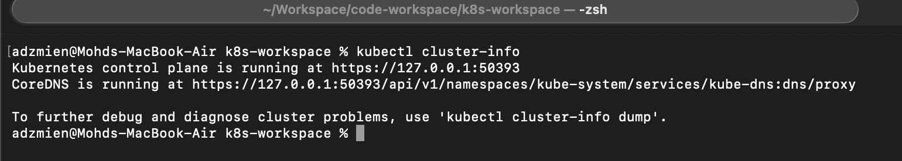
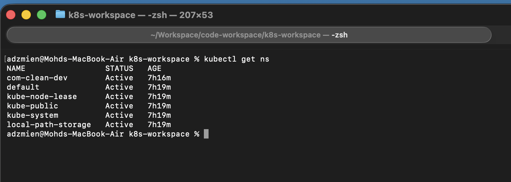
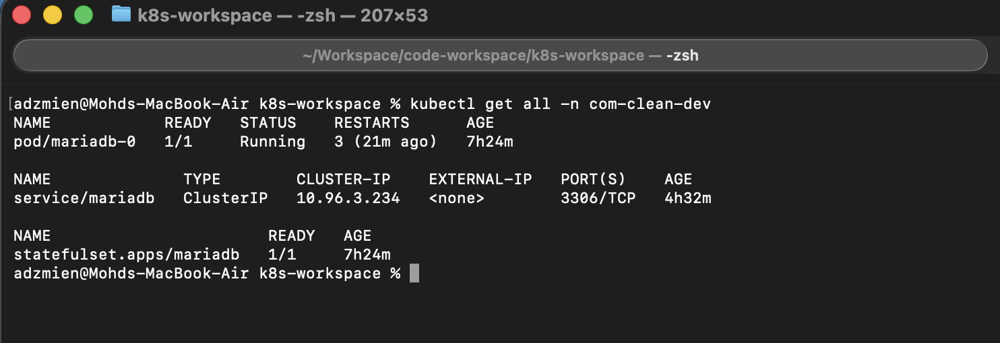
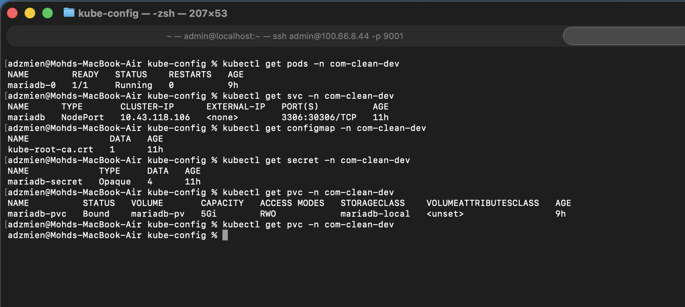

# Kubernetes Quickstart for Developers

This module now supports deterministic deployment automation through `make`, while still keeping direct `kubectl` commands available for troubleshooting.

## Automation Commands (Recommended)

Run all commands from `clean-common-k8s/`.

```bash
# Deploy everything (namespace + mariadb + redis + infinispan)
make deploy

# Deploy selected component
make deploy-db
make deploy-redis
make deploy-infinispan

# Delete resources
make destroy
make destroy-db
make destroy-redis
make destroy-infinispan

# Validate manifests client-side (no cluster write)
make dry-run
make dry-run-infinispan

# Inspect current state
make status
make status-infinispan
```

### Environment Variables

```bash
# Optional overrides
ENV=dev                             # profile name (default: dev)
K8S_NAMESPACE=com-clean-dev         # optional override (highest precedence)
DB_SERVICE_MODE=nodeport            # nodeport | clusterip (optional override)
KUBE_CONTEXT=my-cluster-context     # optional override
```

Examples:

```bash
make print-config ENV=dev
make deploy ENV=dev
make deploy ENV=sit
make deploy ENV=sit DB_SERVICE_MODE=clusterip
make dry-run ENV=sit K8S_NAMESPACE=com-clean-stage
make status KUBE_CONTEXT=kind-kind
```

ENV naming rule:
- Use lowercase letters, numbers, and hyphens only (example: `dev`, `sit`, `uat-1`)

Override precedence:
1. Explicit command vars (`K8S_NAMESPACE`, `DB_SERVICE_MODE`, `KUBE_CONTEXT`)
2. Profile values from `ENV` (`environments/<ENV>.env`)

## Add New Environment

1. Create a profile file:
   - `environments/<env>.env`
2. Add required values:
   - `ENV_NAMESPACE=<k8s-namespace>`
   - `ENV_DB_SERVICE_MODE=nodeport|clusterip`
   - `ENV_KUBE_CONTEXT=<optional-context>`
3. Validate configuration:
   - `make print-config ENV=<env>`
4. Validate manifests:
   - `make dry-run ENV=<env>`
5. Deploy:
   - `make deploy ENV=<env>`
   - or run GitHub workflow with input `environment=<env>`

## GitHub Actions Deploy

Workflow file: `.github/workflows/k8s-deploy.yml`

- Trigger: `workflow_dispatch`
- Inputs:
  - `environment`: free-text profile name (for example: `dev`, `sit`, `uat`)
  - `component`: `all | db | redis | infinispan`
  - `db_service_mode`: `nodeport | clusterip`
- Required secret: `KUBE_CONFIG_DATA` (base64-encoded kubeconfig)
- Execution order in CI: `make dry-run` then selected deploy target

## Common kubectl CLI

<details>
  <summary>Click to expand</summary>

### Get cluster info

```bash
kubectl cluster-info
```



### List all namespaces

```bash
kubectl get ns
```



### List all resources in the namespace

```bash
kubectl get all -n com-clean-dev
```



### List by type in the namespace

```bash
kubectl get pods -n com-clean-dev
```



</details>
