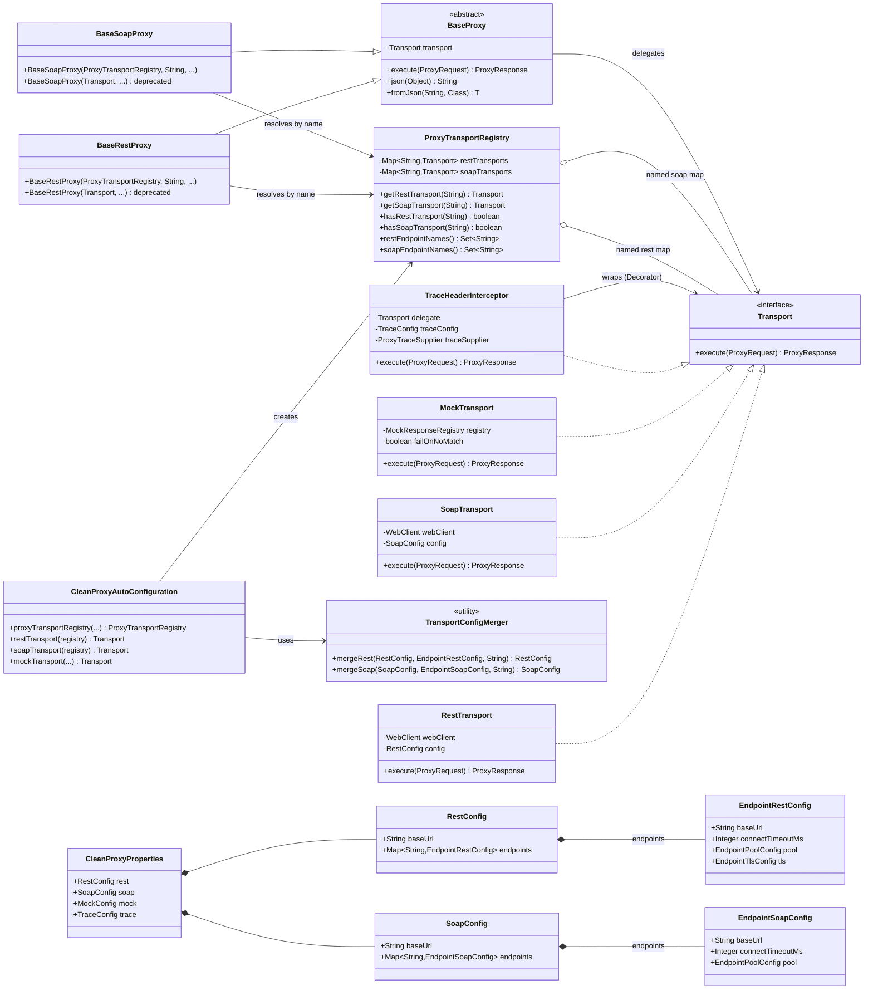

# clean-common-proxy

**Group:** `com.clean` | **Artifact:** `clean-common-proxy` | **Version:** `0.0.1-SNAPSHOT`

     

---

## Description

`clean-common-proxy` is a **standalone, transport-agnostic outbound HTTP client java-library** for the Clean Architecture microservices monorepo. It abstracts REST, SOAP, and Mock transports behind a unified `Transport` interface so API modules can make outbound calls with zero transport lock-in and minimal boilerplate.

> This library has **no dependencies on other repo modules**. It depends only on external libraries (Spring WebFlux, Reactor Netty, Jackson, Lombok).

### What it provides

| Category | Components |
|----------|-----------|
| Contract | `Transport` — Strategy interface for all outbound calls |
| DTOs | `ProxyRequest`, `ProxyResponse` — immutable request/response value objects |
| REST | `RestTransport` — WebClient-based JSON/REST transport |
| SOAP | `SoapTransport` — raw HTTP POST SOAP-over-HTTP transport (`Content-Type: text/xml`) |
| Mock | `MockTransport`, `MockResponseRegistry`, `MockResponseDefinition` — URI-pattern-matched mock responses |
| Registry | `ProxyTransportRegistry` — named transport lookup for multi-endpoint support |
| Merger | `TransportConfigMerger` — merges per-endpoint config overrides onto global defaults |
| Base | `BaseProxy`, `BaseRestProxy`, `BaseSoapProxy` — Template Method base classes for consuming modules |
| Decorator | `TraceHeaderInterceptor` — injects distributed trace headers on every outbound call |
| Trace SPI | `ProxyTraceSupplier` — interface for supplying trace IDs; no-op default, override in your app |
| Pool | `ProxyConnectionPoolManager`, `ReactorNettyClientFactory` — named Reactor Netty connection pool registry |
| Logger | `ProxyExchangeLogger` — stateless request/response exchange logger |
| Exception | `ProxyException` — unchecked exception wrapping HTTP status codes and transport errors |
| Configuration | `CleanProxyProperties` — `clean.proxy.*` configuration properties |
| Auto-config | `CleanProxyAutoConfiguration` — wires all transports + trace decorator + named endpoint registry |

> **Spring Boot auto-configuration included.** `CleanProxyAutoConfiguration` is registered via `AutoConfiguration.imports` and activates automatically when the library is on the classpath.

---

## Tech Stack

| Item | Version |
|------|---------|
| Java | 21 (Temurin 21.0.9) |
| Gradle | 8.8 (Groovy DSL) |
| Spring Boot BOM | 3.5.x |
| Spring WebFlux | via BOM |
| Reactor Netty HTTP | via BOM |
| Jackson | via BOM |
| Lombok | 1.18.36 |

---

## Build & Publish

> **Prerequisite:** Run `j21` before any Gradle command to activate the Java 21 runtime.

```bash
j21
cd /path/to/clean-common-proxy
./gradlew clean build publishToMavenLocal
```

Published artifact location:

```
~/.m2/repository/com/clean/clean-common-proxy/0.0.1-SNAPSHOT/
```

---

## Add as Dependency

In your consumer module's `build.gradle`:

```groovy
repositories {
    mavenLocal()
    mavenCentral()
}

dependencies {
    implementation 'com.clean:clean-common-proxy:0.0.1-SNAPSHOT'
}
```

---

## How to Use the Library

### 1. Configuration

#### Single endpoint (simple / backward-compatible)

Set a global `base-url` per transport type. All proxy calls use this URL:

```properties
# REST transport (enabled by default when library is on classpath)
clean.proxy.rest.enabled=true
clean.proxy.rest.base-url=https://api.example.com
clean.proxy.rest.connect-timeout-ms=5000
clean.proxy.rest.read-timeout-ms=30000
clean.proxy.rest.response-timeout-ms=30000
clean.proxy.rest.write-timeout-ms=30000
clean.proxy.rest.max-in-memory-size-mb=5
clean.proxy.rest.pool.name=default-proxy-pool
clean.proxy.rest.pool.max-connections=500
clean.proxy.rest.pool.pending-acquire-timeout-ms=45000
clean.proxy.rest.pool.max-idle-time-ms=20000
clean.proxy.rest.tls.insecure=false

# SOAP transport (opt-in)
clean.proxy.soap.enabled=false
clean.proxy.soap.base-url=https://soap.example.com
clean.proxy.soap.connect-timeout-ms=5000
clean.proxy.soap.read-timeout-ms=30000

# Mock transport (opt-in — never active by default)
clean.proxy.mock.enabled=false
clean.proxy.mock.fail-on-no-match=true
clean.proxy.mock.definitions[0].uri-pattern=.*/payment.*
clean.proxy.mock.definitions[0].status-code=200
clean.proxy.mock.definitions[0].body={"status":"ok"}
clean.proxy.mock.definitions[0].delay-ms=0

# Trace header names (defaults shown)
clean.proxy.trace.server-trace-header=X-Trace-Id
clean.proxy.trace.client-trace-header=Client-Trace-Id
```

#### Multiple named endpoints

When a service calls **multiple upstream systems**, define named endpoints under `endpoints.*`. Each named endpoint gets its own `WebClient` and isolated connection pool:

```properties
# Global REST defaults (apply to all named endpoints unless overridden)
clean.proxy.rest.enabled=true
clean.proxy.rest.connect-timeout-ms=5000
clean.proxy.rest.read-timeout-ms=30000
clean.proxy.rest.response-timeout-ms=30000
clean.proxy.rest.write-timeout-ms=30000
clean.proxy.rest.pool.max-connections=500

# Named REST endpoints
clean.proxy.rest.endpoints.payment.base-url=http://aaa.com/payment
clean.proxy.rest.endpoints.payment.connect-timeout-ms=3000
clean.proxy.rest.endpoints.payment.pool.max-connections=200

clean.proxy.rest.endpoints.report.base-url=http://bbb.com/report
# report inherits all timeouts and pool settings from global defaults

# Named SOAP endpoints
clean.proxy.soap.enabled=true
clean.proxy.soap.connect-timeout-ms=5000
clean.proxy.soap.read-timeout-ms=30000

clean.proxy.soap.endpoints.message.base-url=http://kkk.soap/message
clean.proxy.soap.endpoints.shop.base-url=http://jjj.soap/shop
clean.proxy.soap.endpoints.shop.connect-timeout-ms=8000
```

**Per-endpoint overridable fields:**

| Field | REST | SOAP | Default when omitted |
|-------|------|------|----------------------|
| `base-url` | yes | yes | Inherited from global |
| `connect-timeout-ms` | yes | yes | Inherited from global |
| `read-timeout-ms` | yes | yes | Inherited from global |
| `response-timeout-ms` | yes | yes | Inherited from global |
| `write-timeout-ms` | yes | — | Inherited from global |
| `max-in-memory-size-mb` | yes | — | Inherited from global |
| `default-headers.*` | yes | yes | Merged (global first, endpoint overrides) |
| `pool.name` | yes | yes | Auto-derived: `{name}-rest-pool` / `{name}-soap-pool` |
| `pool.max-connections` | yes | yes | Inherited from global |
| `pool.pending-acquire-timeout-ms` | yes | yes | Inherited from global |
| `pool.max-idle-time-ms` | yes | yes | Inherited from global |
| `pool.max-life-time-ms` | yes | yes | Inherited from global |
| `tls.insecure` | yes | — | Inherited from global |
| `tls.trust-store-path` | yes | — | Inherited from global |
| `tls.trust-store-password` | yes | — | Inherited from global |

> **Pool isolation:** When a named endpoint does not declare a custom pool, the merger auto-derives a unique pool name (`{name}-rest-pool` / `{name}-soap-pool`). This ensures each upstream gets its own connection pool — a slow upstream cannot starve connections to other upstreams.

---

### 2. REST Transport

#### Named endpoint (preferred — multi-endpoint)

Extend `BaseRestProxy` and pass the registry + endpoint name in the constructor:

```java
@Component
public class PaymentProxy extends BaseRestProxy {

    public PaymentProxy(ProxyTransportRegistry registry,
                        ProxyExchangeLogger logger,
                        ObjectMapper objectMapper) {
        super(registry, "payment", logger, objectMapper);
    }

    public PaymentResponse pay(PaymentRequest req) {
        ProxyResponse res = execute(ProxyRequest.builder()
            .uri("/charge")
            .method(ProxyRequest.HttpMethod.POST)
            .body(json(req))
            .build());
        return fromJson(res.getBody(), PaymentResponse.class);
    }
}

@Component
public class ReportProxy extends BaseRestProxy {

    public ReportProxy(ProxyTransportRegistry registry,
                       ProxyExchangeLogger logger,
                       ObjectMapper objectMapper) {
        super(registry, "report", logger, objectMapper);
    }

    public ReportDTO fetchReport(String reportId) {
        ProxyResponse res = execute(ProxyRequest.builder()
            .uri("/reports/" + reportId)
            .method(ProxyRequest.HttpMethod.GET)
            .build());
        return fromJson(res.getBody(), ReportDTO.class);
    }
}
```

> **Fail-fast:** An unrecognised endpoint name throws `IllegalArgumentException` at Spring context startup — before the application serves any traffic. The error message lists all registered endpoint names.

#### Single default endpoint (backward-compatible)

When only one REST upstream exists, set `clean.proxy.rest.base-url` and use the old constructor (still works, but deprecated):

```java
@Component
public class PaymentServiceProxy extends BaseRestProxy {

    // @Deprecated — use registry-based constructor for new implementations
    public PaymentServiceProxy(@Qualifier("restTransport") Transport transport,
                               ProxyExchangeLogger logger,
                               ObjectMapper objectMapper) {
        super(transport, logger, objectMapper);
    }

    public PaymentResponse pay(PaymentRequest req) {
        ProxyResponse res = execute(ProxyRequest.builder()
            .uri("/payment")
            .method(ProxyRequest.HttpMethod.POST)
            .body(json(req))
            .build());
        return fromJson(res.getBody(), PaymentResponse.class);
    }
}
```

**Available `BaseProxy` helpers:**

| Method | Description |
|--------|-------------|
| `execute(ProxyRequest)` | Sends the request via the transport; logs request + response |
| `json(Object)` | Serializes object to compact JSON string |
| `fromJson(String, Class<T>)` | Deserializes JSON string to type `T` |
| `fromJson(String, TypeReference<T>)` | Deserializes JSON to generic type (e.g. `List<Foo>`) |

---

### 3. SOAP Transport

#### Named endpoint (preferred — multi-endpoint)

```java
@Component
public class MessageProxy extends BaseSoapProxy {

    public MessageProxy(ProxyTransportRegistry registry,
                        ProxyExchangeLogger logger,
                        ObjectMapper objectMapper) {
        super(registry, "message", logger, objectMapper);
    }

    public String sendMessage(String soapEnvelope) {
        ProxyResponse res = execute(ProxyRequest.builder()
            .uri("/MessageService")
            .method(ProxyRequest.HttpMethod.POST)
            .body(soapEnvelope)
            .build());
        return res.getBody();
    }
}

@Component
public class ShopProxy extends BaseSoapProxy {

    public ShopProxy(ProxyTransportRegistry registry,
                     ProxyExchangeLogger logger,
                     ObjectMapper objectMapper) {
        super(registry, "shop", logger, objectMapper);
    }
}
```

#### Single default endpoint (backward-compatible)

```properties
clean.proxy.soap.enabled=true
clean.proxy.soap.base-url=https://legacy.example.com/ws
```

```java
@Component
public class LegacyServiceProxy extends BaseSoapProxy {

    // @Deprecated — use registry-based constructor for new implementations
    public LegacyServiceProxy(@Qualifier("soapTransport") Transport transport,
                              ProxyExchangeLogger logger,
                              ObjectMapper objectMapper) {
        super(transport, logger, objectMapper);
    }

    public String invokeOperation(String soapEnvelope) {
        ProxyResponse res = execute(ProxyRequest.builder()
            .uri("/LegacyService")
            .method(ProxyRequest.HttpMethod.POST)
            .body(soapEnvelope)
            .build());
        return res.getBody();
    }
}
```

> **Note:** SOAP transport sends raw HTTP POST with `Content-Type: text/xml`. There is no Spring-WS dependency — this is a lightweight raw HTTP approach.

---

### 4. Mock Transport

Enable mock mode to stub outbound calls without hitting real endpoints — useful in dev/test environments:

```properties
clean.proxy.mock.enabled=true
clean.proxy.mock.fail-on-no-match=true

clean.proxy.mock.definitions[0].uri-pattern=.*/payment.*
clean.proxy.mock.definitions[0].status-code=200
clean.proxy.mock.definitions[0].body={"transactionId":"TXN-001","status":"approved"}
clean.proxy.mock.definitions[0].delay-ms=50

clean.proxy.mock.definitions[1].uri-pattern=.*/refund.*
clean.proxy.mock.definitions[1].status-code=200
clean.proxy.mock.definitions[1].body={"refundId":"REF-001","status":"processed"}
```

- `uri-pattern` is a **Java regex** matched against the full request URI.
- When `fail-on-no-match=true`, unmatched URIs throw `ProxyException(404)` to surface misconfigured stubs early.
- When `fail-on-no-match=false`, unmatched URIs return an empty `200 OK`.
- `delay-ms` simulates network latency for realistic load testing.

---

### 5. Trace Header Propagation

Every transport bean (including all named endpoints) is automatically wrapped by `TraceHeaderInterceptor`. It reads trace IDs from the injected `ProxyTraceSupplier` and appends them to every outbound request.

**Default behaviour:** The auto-configuration registers a no-op `ProxyTraceSupplier` (returns `null` — no headers injected).

**To enable real trace propagation**, register a `@Bean ProxyTraceSupplier` in your application:

```java
@Configuration
public class ProxyTraceConfiguration {

    @Bean
    @ConditionalOnMissingBean(ProxyTraceSupplier.class)
    public ProxyTraceSupplier proxyTraceSupplier() {
        return new ProxyTraceSupplier() {
            public String getServerTraceId() { return TraceContext.current(); }
            public String getClientTraceId() { return ClientTraceContext.current(); }
        };
    }
}
```

**Customise header names** (defaults shown):

```properties
clean.proxy.trace.server-trace-header=X-Trace-Id
clean.proxy.trace.client-trace-header=Client-Trace-Id
```

> **Note:** `TraceHeaderInterceptor` reads on the calling thread — safe for blocking servlet stacks. For async propagation (virtual threads, `@Async`, `CompletableFuture`), implement `ProxyTraceSupplier` using a Micrometer context propagation strategy.

---

### 6. Connection Pool Tuning

Each transport and named endpoint gets its own isolated Reactor Netty connection pool.

#### Global pool (single endpoint / default)

```properties
clean.proxy.rest.pool.name=rest-pool
clean.proxy.rest.pool.max-connections=500
clean.proxy.rest.pool.pending-acquire-timeout-ms=45000
clean.proxy.rest.pool.max-idle-time-ms=20000
clean.proxy.rest.pool.max-life-time-ms=0

clean.proxy.soap.pool.name=soap-pool
clean.proxy.soap.pool.max-connections=100
```

#### Per-named-endpoint pool override

```properties
# payment endpoint uses a dedicated high-throughput pool
clean.proxy.rest.endpoints.payment.pool.name=payment-pool
clean.proxy.rest.endpoints.payment.pool.max-connections=300
clean.proxy.rest.endpoints.payment.pool.max-idle-time-ms=15000

# report endpoint auto-derives pool name "report-rest-pool" and inherits global settings
# (no explicit pool config needed)
```

- `max-life-time-ms=0` means unlimited connection lifetime.
- `ProxyConnectionPoolManager` holds named `ConnectionProvider` instances — shared across factory rebuilds.
- Named endpoints without a custom pool name auto-derive `{name}-rest-pool` / `{name}-soap-pool` to prevent cross-endpoint pool sharing.

---

### 7. TLS / HTTPS

For REST transport (global or per named endpoint):

```properties
# Use system trust store (standard HTTPS) — global
clean.proxy.rest.tls.enabled=true
clean.proxy.rest.tls.insecure=false

# Custom trust store — global
clean.proxy.rest.tls.trust-store-path=/certs/truststore.jks
clean.proxy.rest.tls.trust-store-password=changeit

# Disable certificate validation (dev/test only — never in production) — global
clean.proxy.rest.tls.insecure=true

# Per-endpoint TLS override
clean.proxy.rest.endpoints.payment.tls.insecure=false
clean.proxy.rest.endpoints.payment.tls.trust-store-path=/certs/payment-truststore.jks
clean.proxy.rest.endpoints.payment.tls.trust-store-password=changeit
```

---

## Package Structure

```
com.clean.common.proxy
├── autoconfigure
│   └── CleanProxyAutoConfiguration      (Spring Boot auto-configuration)
├── contract
│   └── Transport                         (Strategy interface — all transports)
├── dto
│   ├── ProxyRequest                      (immutable outbound request value object)
│   └── ProxyResponse                     (immutable inbound response value object)
├── exception
│   └── ProxyException                    (RuntimeException — wraps HTTP status + transport errors)
├── interceptor
│   └── TraceHeaderInterceptor            (Decorator — injects trace headers on every call)
├── logger
│   └── ProxyExchangeLogger               (stateless request/response exchange logger)
├── mock
│   ├── MockTransport                     (Strategy — URI-pattern-matched mock responses)
│   ├── MockResponseRegistry              (thread-safe registry of mock definitions)
│   └── MockResponseDefinition            (value object — uri pattern, status, body, delay)
├── pool
│   └── ProxyConnectionPoolManager        (Factory + Registry — named Reactor Netty pools)
├── properties
│   ├── CleanProxyProperties              (clean.proxy.* config properties)
│   ├── EndpointRestConfig                (per-named-endpoint REST config overrides)
│   └── EndpointSoapConfig                (per-named-endpoint SOAP config overrides)
├── registry
│   ├── ProxyTransportRegistry            (Registry — named Transport lookup, fail-fast)
│   └── TransportConfigMerger             (utility — merges endpoint config over global defaults)
├── rest
│   ├── RestTransport                     (Strategy — WebClient-based REST)
│   └── ReactorNettyClientFactory         (Factory — builds WebClient from config)
├── soap
│   └── SoapTransport                     (Strategy — raw HTTP POST SOAP-over-HTTP)
├── support
│   ├── BaseProxy                         (Template Method — execution skeleton + helpers)
│   ├── BaseRestProxy                     (convenience subclass — registry or restTransport qualifier)
│   └── BaseSoapProxy                     (convenience subclass — registry or soapTransport qualifier)
└── trace
    └── ProxyTraceSupplier                (SPI interface — supply trace IDs to interceptor)
```

---

## Class Diagram



---

## Key Design Decisions

| Decision | Rationale |
|----------|-----------|
| `Transport` Strategy interface | REST, SOAP, and Mock are interchangeable — consuming modules depend on the interface, not concrete implementations (DIP). Swap transport at runtime via qualifier or registry lookup |
| `ProxyTransportRegistry` — Registry pattern | Multiple named upstreams are supported without dynamic Spring bean registration tricks. Each endpoint is a Strategy instance keyed by name, built at startup and held in an immutable map. Fail-fast lookup prevents silent misconfiguration |
| `TransportConfigMerger` — pure utility | Merge logic is decoupled from Spring entirely — plain Java, no annotations. Testable without a Spring context. Endpoint overrides a nullable fields so omitting a field always falls back to the global default |
| Auto-derived pool names | Named endpoints without an explicit pool name get `{name}-rest-pool` / `{name}-soap-pool` automatically, ensuring pool isolation between upstreams. One slow upstream cannot exhaust connections for others |
| Backward-compat alias beans | The `restTransport` and `soapTransport` qualified beans are retained as delegation aliases pointing to `registry.getXxxTransport("default")`. Existing `@Qualifier` injections and deprecated `BaseRestProxy(Transport, ...)` constructors continue to work with zero migration cost |
| `TraceHeaderInterceptor` Decorator | Trace injection is applied once at auto-config bean creation for every named transport — transport implementations are unaware of trace logic (SRP, OCP). All endpoints share the same Decorator behaviour |
| `ProxyTraceSupplier` SPI | Decouples trace ID sourcing from the library itself — no dependency on `clean-common-lib`'s ThreadLocal holders. Consuming apps register their own `@Bean`; no-op default prevents startup failure when no supplier is configured |
| `BaseProxy` Template Method | Common execution skeleton (transport call + logging) lives in the base; subclasses only implement domain-specific request/response handling — eliminates boilerplate without sacrificing flexibility |
| `@ConditionalOnMissingBean` throughout | All auto-configured beans are overrideable by consuming modules — prevents configuration conflict and supports testing with custom transports |
| Reactor Netty `ConnectionProvider` | Named, reusable connection pools are registered in `ProxyConnectionPoolManager` — prevents connection exhaustion under load and allows per-transport and per-endpoint pool tuning |
| SOAP as raw HTTP POST | No Spring-WS dependency — keeps the library lightweight. SOAP envelope construction is the consuming module's responsibility; this library only handles the HTTP transport layer |
| Mock transport with regex matching | URI-pattern-based matching supports flexible stub definitions without a separate mock server. `fail-on-no-match=true` surfaces misconfigured stubs early in development |
