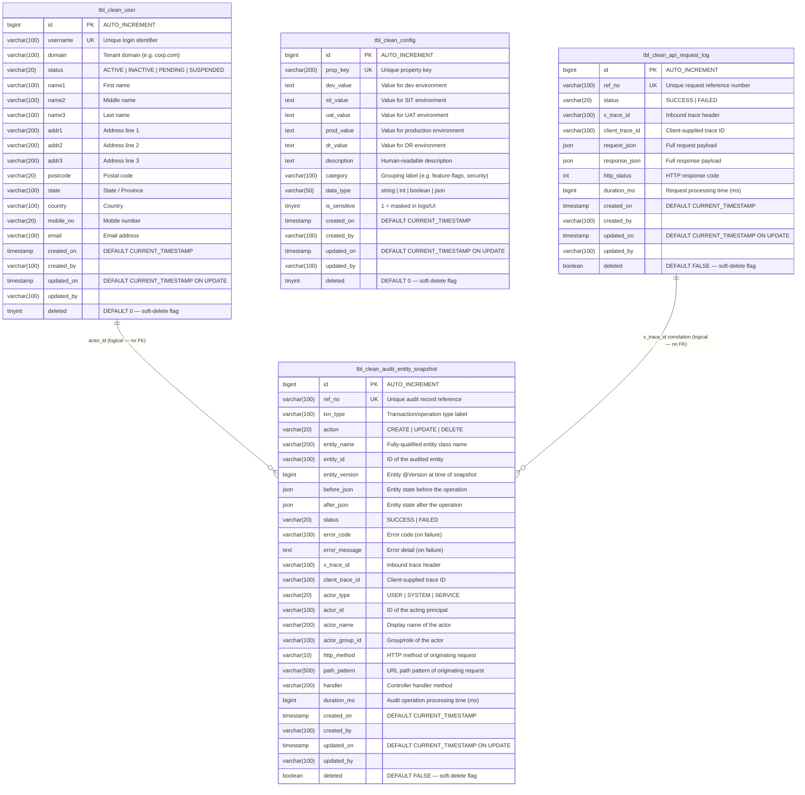

# Entity Relationship Diagram

**Date:** 2026-03-14
**Module:** `clean-common-sql`
**Database:** MariaDB | **Schema:** `clean_dev`

---

## Entity Relationship Diagram

---

## Relationships

| From | To | Join Field | Type |
|------|----|------------|------|
| `tbl_clean_user` | `tbl_clean_audit_entity_snapshot` | `actor_id` ↔ `username` | Logical (no FK) |
| `tbl_clean_api_request_log` | `tbl_clean_audit_entity_snapshot` | `x_trace_id` ↔ `x_trace_id` | Logical (no FK) |

> **No foreign key constraints exist in the DDL.** Relationships are logical and resolved at the application/query level. This is intentional — the audit snapshot table must remain writable even if the referenced user or log record is deleted or unavailable.

---

## Index Summary

### tbl_clean_user

| Index | Columns | Type |
|-------|---------|------|
| `uk_username` | `username` | UNIQUE |
| `idx_domain` | `domain` | INDEX |
| `idx_status` | `status` | INDEX |

### tbl_clean_config

| Index | Columns | Type |
|-------|---------|------|
| `uk_prop_key` | `prop_key` | UNIQUE |
| `idx_prop_key` | `prop_key` | INDEX |
| `idx_category` | `category` | INDEX |
| `idx_is_sensitive` | `is_sensitive` | INDEX |

### tbl_clean_api_request_log

| Index | Columns | Type |
|-------|---------|------|
| `uk_ref_no` | `ref_no` | UNIQUE |
| `idx_status` | `status` | INDEX |
| `idx_x_trace_id` | `x_trace_id` | INDEX |
| `idx_client_trace_id` | `client_trace_id` | INDEX |
| `idx_created_on` | `created_on` | INDEX |
| `idx_deleted` | `deleted` | INDEX |

### tbl_clean_audit_entity_snapshot

| Index | Columns | Type |
|-------|---------|------|
| `uk_ref_no` | `ref_no` | UNIQUE |
| `idx_txn_type` | `txn_type` | INDEX |
| `idx_entity` | `entity_name`, `entity_id` | COMPOSITE INDEX |
| `idx_status` | `status` | INDEX |
| `idx_x_trace_id` | `x_trace_id` | INDEX |
| `idx_client_trace_id` | `client_trace_id` | INDEX |
| `idx_actor_id` | `actor_id` | INDEX |
| `idx_created_on` | `created_on` | INDEX |

---

## Migration History

| Version | File | Table Affected | Change |
|---------|------|----------------|--------|
| V260125001 | `create_tbl_clean_user.sql` | `tbl_clean_user` (as TBL_CLEAN_USER) | Initial create |
| V260128001 | `create_tbl_clean_config.sql` | `tbl_clean_config` (as TBL_CLEAN_CONFIG) | Initial create |
| V260221001 | `alter_tbl_clean_config_add_deleted.sql` | `tbl_clean_config` | Add `deleted TINYINT(1)` |
| V260225001 | `create_tbl_clean_api_request_log.sql` | `tbl_clean_api_request_log` (uppercase) | Initial create |
| V260225002 | `add_deleted_to_tbl_clean_api_request_log.sql` | `tbl_clean_api_request_log` (uppercase) | Add `deleted BOOLEAN` + `idx_deleted` |
| V260225003 | `rename_tables_to_lowercase.sql` | user, config, api_request_log | Rename all to lowercase |
| V260228001 | `create_tbl_clean_audit_entity_snapshot.sql` | `tbl_clean_audit_entity_snapshot` (uppercase) | Initial create |
| V260228002 | `add_deleted_to_tbl_clean_audit_entity_snapshot.sql` | `tbl_clean_audit_entity_snapshot` (uppercase) | Add `deleted BOOLEAN` |
| V260302001 | `rename_audit_table_to_lowercase.sql` | audit snapshot | Rename to lowercase |
