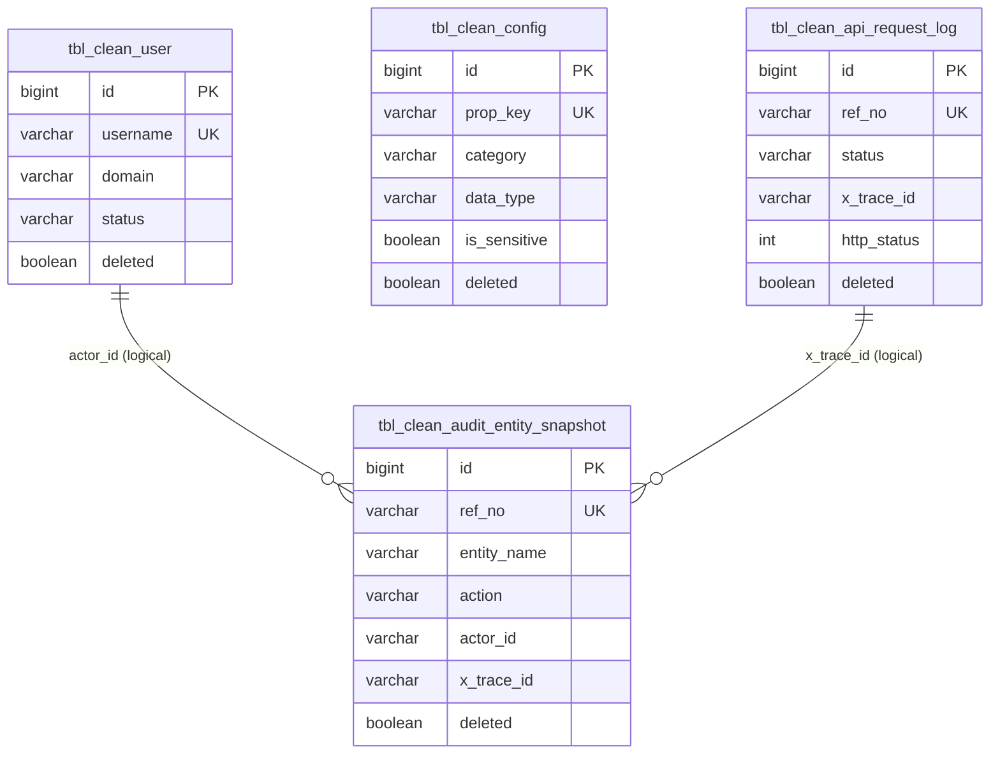

# clean-common-sql

**Schema:** `clean_dev` | **Flyway Strategy:** `dual-history` | **Environments:** `dev | sit | uat | prod | dr`

    

---

## Description

`clean-common-sql` is the **Flyway-managed database migration module** for the Clean Architecture monorepo. It owns all DDL schema definitions, reference DML, and development sample data for MariaDB. Migrations are organized into two isolated tracks — `ddl-dml/` for production schema and `dummy/` for development seed data — each with its own Flyway history table to prevent pollution of the production migration record.

> Schema diagrams live in [`ERD.md`](ERD.md) and [`clean-common-doc/architecture/diagrams/erd-260314-clean-common-sql.md`](../clean-common-doc/architecture/diagrams/erd-260314-clean-common-sql.md).

### What it provides

| Category | Components |
|----------|------------|
| Schema migrations | `ddl-dml/` — DDL + reference DML; history tracked in `flyway_schema_history` |
| Seed data | `dummy/` — development sample data; history tracked in `flyway_schema_history_dummy` |
| Rollback system | `rollback/{YYMMDD}/` — date-organized manual rollback scripts |
| Custom Gradle tasks | `flywayMigrateDdlDml`, `flywayMigrateDummy`, `flywayInfoDummy`, `flywayValidateDummy`, `flywayCleanDummy`, `flywayRollback` |
| Environment config | `gradle/env/{env}.properties` — per-environment JDBC URLs (`dev`, `sit`, `uat`, `prod`, `dr`) |
| Safety guards | `cleanDisabled=true` default; prod/dr blocked from running dummy tasks; interactive rollback confirmation |

---

## Tech Stack

| Item | Version |
|------|---------|
| Java | 21 (Temurin 21.0.9) |
| Gradle | 8.8 (Groovy DSL) |
| Spring Boot BOM | 3.5.x |
| Flyway MySQL | 10.4.1 |
| MariaDB JDBC | 3.3.2 |
| MariaDB | 11.x |

---

## Run Migrations

> **Prerequisite:** Run `j21` before any Gradle command to activate the Java 21 runtime.

### Environment Selection

Pass `-Penv=<env>` to select the target environment. JDBC URL is resolved from `gradle/env/<env>.properties`.

| Env | JDBC URL |
|-----|----------|
| `dev` | `jdbc:mariadb://100.66.8.44:30306/clean_dev` |
| `sit` | `gradle/env/sit.properties` |
| `uat` | `gradle/env/uat.properties` |
| `prod` | `gradle/env/prod.properties` |
| `dr` | `gradle/env/dr.properties` |

Password is resolved from the `FLYWAY_PASSWORD` environment variable or the `-Pflyway.password` flag. Never commit passwords to `gradle.properties`.

### Available Commands

| Task | Scope | History Table | Prod-safe? |
|------|-------|---------------|------------|
| `flywayInfo` | DDL+DML status | `flyway_schema_history` | ✅ Yes |
| `flywayValidate` | DDL+DML integrity | `flyway_schema_history` | ✅ Yes |
| `flywayMigrateDdlDml` | DDL+DML only | `flyway_schema_history` | ✅ **Recommended** |
| `flywayMigrate` | DDL+DML only (same scope) | `flyway_schema_history` | ✅ Yes |
| `flywayRepair` | Fix failed entries | `flyway_schema_history` | ⚠️ Careful |
| `flywayBaseline` | Initialize tracking | `flyway_schema_history` | ⚠️ Careful |
| `flywayRollback` | Interactive date rollback | `flyway_schema_history` | ⚠️ Careful |
| `flywayMigrateDummy` | Seed data only | `flyway_schema_history_dummy` | ❌ Dev/SIT/UAT only |
| `flywayInfoDummy` | Seed data status | `flyway_schema_history_dummy` | ℹ️ Dev/SIT/UAT only |
| `flywayValidateDummy` | Seed data integrity | `flyway_schema_history_dummy` | ℹ️ Dev/SIT/UAT only |
| `flywayCleanDummy` | Drop dummy history table | `flyway_schema_history_dummy` | ❌ Dev only |
| `flywayClean` | Drop all DB objects | — | ❌ **NEVER in prod** |

### Command Examples

```bash
# --- Production / Staging ---
j21
FLYWAY_PASSWORD=*** ./gradlew flywayMigrateDdlDml -Penv=prod

# --- Check migration status ---
FLYWAY_PASSWORD=*** ./gradlew flywayInfo -Penv=uat

# --- Development: schema + seed data ---
j21
FLYWAY_PASSWORD=*** ./gradlew flywayMigrateDdlDml -Penv=dev
FLYWAY_PASSWORD=*** ./gradlew flywayMigrateDummy  -Penv=dev

# --- Manual URL override ---
./gradlew flywayMigrateDdlDml -Penv=prod \
  -Pflyway.url=jdbc:mariadb://x.x.x.x:3306/clean_dev \
  -Pflyway.password=***
```

---

## Migration Naming Convention

```
V{YYMMDD}{XXX}__{description}.sql
```

| Part | Meaning | Example |
|------|---------|---------|
| `V` | Flyway version prefix | `V` |
| `YYMMDD` | Year-Month-Day | `260125` → Jan 25, 2026 |
| `XXX` | Same-day sequence | `001`, `002`, `003` |
| `__` | Double-underscore separator (Flyway required) | `__` |
| `description` | Descriptive name | `create_tbl_clean_user` |

**Examples:**

```
V260125001__create_tbl_clean_user.sql
V260128001__create_tbl_clean_config.sql
V260225001__create_tbl_clean_api_request_log.sql
V260228001__create_tbl_clean_audit_entity_snapshot.sql
```

> Migrations are **sealed** once applied. Never modify a committed migration file — create a new version instead.

---

## Dual-History Strategy

Two Flyway history tables keep production and seed data migrations isolated:

| History Table | Tracks | Used By |
|---|---|---|
| `flyway_schema_history` | DDL + reference DML from `ddl-dml/` | `flywayMigrateDdlDml`, `flywayInfo`, `flywayValidate` |
| `flyway_schema_history_dummy` | Seed data from `dummy/` | `flywayMigrateDummy`, `flywayInfoDummy`, `flywayValidateDummy`, `flywayCleanDummy` |

This ensures the production history is clean and auditable — test data never appears in `flyway_schema_history`.

---

## Rollback System

Rollback scripts live in `rollback/{YYMMDD}/` and are executed interactively:

```bash
FLYWAY_PASSWORD=*** ./gradlew flywayRollback -Penv=sit
```

The task prompts for a `YYMMDD` date, validates that scripts exist for that date, shows which scripts will run, requests explicit confirmation, and executes in **reverse order**.

**Rollback script naming:**
```
rollback/{YYMMDD}/V{YYMMDD}{XXX}__rollback_{description}.sql
```

---

## Directory Structure

```
clean-common-sql/
├── src/main/resources/db/migration/sql/
│   ├── ddl-dml/                  ← Production schema migrations (flyway_schema_history)
│   │   ├── README.md             ← DDL/DML conventions & best practices
│   │   ├── V260125001__create_tbl_clean_user.sql
│   │   ├── V260128001__create_tbl_clean_config.sql
│   │   ├── V260221001__alter_tbl_clean_config_add_deleted.sql
│   │   ├── V260225001__create_tbl_clean_api_request_log.sql
│   │   ├── V260225002__add_deleted_to_tbl_clean_api_request_log.sql
│   │   ├── V260225003__rename_tables_to_lowercase.sql
│   │   ├── V260228001__create_tbl_clean_audit_entity_snapshot.sql
│   │   ├── V260228002__add_deleted_to_tbl_clean_audit_entity_snapshot.sql
│   │   └── V260302001__rename_audit_table_to_lowercase.sql
│   ├── dummy/                    ← Seed/sample data (flyway_schema_history_dummy)
│   │   ├── README.md             ← Dummy data conventions
│   │   ├── V260128001__dev_sample_config.sql
│   │   └── V260128002__dev_sample_users.sql
│   ├── rollback/                 ← Manual rollback scripts (date-organized)
│   │   └── {YYMMDD}/
│   └── README.md                 ← Directory overview
├── gradle/
│   ├── env/                      ← Per-environment JDBC config
│   │   ├── dev.properties
│   │   ├── sit.properties
│   │   ├── uat.properties
│   │   ├── prod.properties
│   │   └── dr.properties
│   └── wrapper/
├── build.gradle                  ← Flyway tasks + custom tasks
├── gradle.properties             ← Non-secret defaults (env, schema, cleanDisabled)
└── settings.gradle
```

---

## Schema Overview

Four production tables. See the full diagram at [`ERD.md`](ERD.md).



> Relationships are **logical only** — no FK constraints in DDL (by design, for audit decoupling).

---

## Key Design Decisions

| Decision | Rationale |
|----------|-----------|
| Dual Flyway history tables (`flyway_schema_history` + `flyway_schema_history_dummy`) | Keeps production migration history clean and auditable — seed data migrations are never visible in the production record |
| `flywayMigrateDdlDml` as the canonical deploy command | Explicit scope — guarantees only `ddl-dml/` migrations are applied; eliminates accidental seed data in production |
| `cleanDisabled=true` by default | Safety guard — prevents accidental schema wipe; must be explicitly overridden via `-Pflyway.cleanDisabled=false` |
| prod/dr blocked from `flywayMigrateDummy` | Enforced at Gradle task level — prevents seed data from ever reaching production environments, regardless of operator error |
| Date-based version prefix (`YYMMDD`) instead of sequential integers | Avoids merge conflicts in feature branches; date provides implicit ordering and traceability |
| Interactive rollback with explicit confirmation | Rollback is manual and deliberate — the task validates script presence, prints what will execute, and requires `yes` before proceeding |
| All tables: `ENGINE=InnoDB`, `utf8mb4_unicode_ci` | InnoDB for transactional integrity; `utf8mb4` for full Unicode including emoji; `_unicode_ci` for correct multi-language collation |
| All tables: soft-delete (`deleted BOOLEAN/TINYINT DEFAULT 0/FALSE`) | Consistent with `BaseEntity` pattern in `clean-common-jpa` — no hard deletes in the domain layer |
| All tables: `created_on`, `created_by`, `updated_on`, `updated_by` audit fields | Matches `BaseEntity` JPA mapping — schema and entity layer stay in sync |
| Lowercase table names (enforced from V260225003 onward) | MariaDB 11.x enforces case-sensitive table lookups by default; Hibernate `@Table(name="tbl_...")` uses lowercase — mismatch causes schema validation failure |
