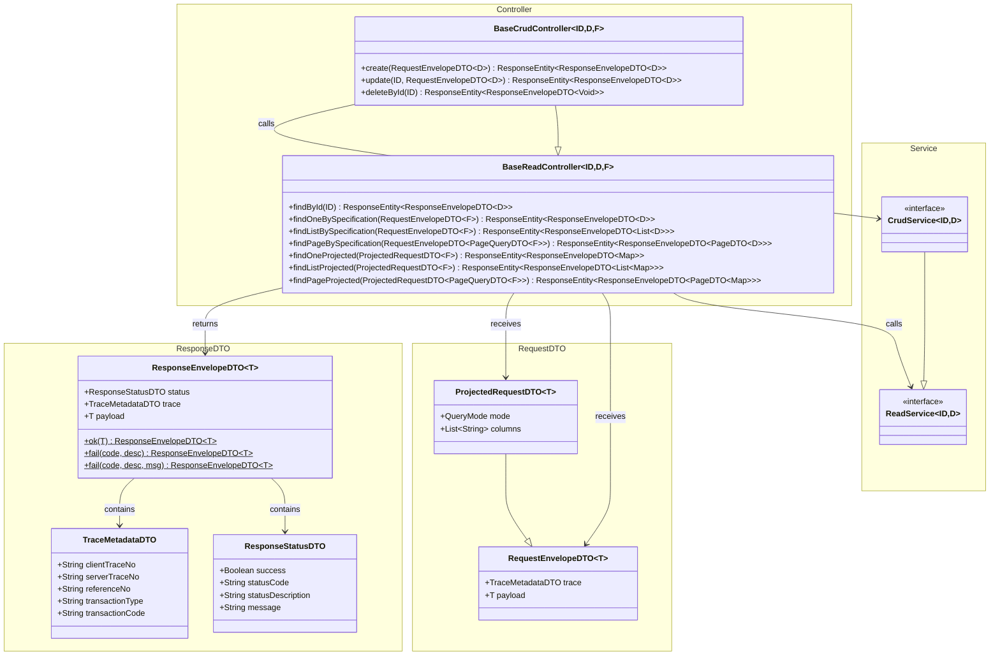
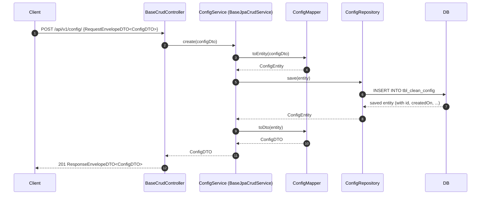
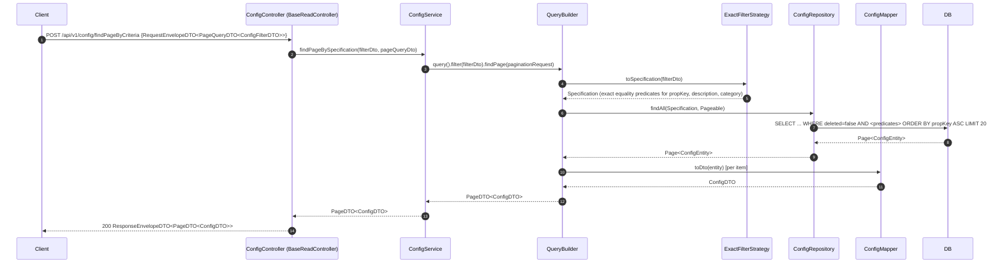

# clean-common-web

**Group:** `com.clean` | **Artifact:** `clean-common-web` | **Version:** `0.0.1-SNAPSHOT`

   

---

## Description

`clean-common-web` is a **pure HTTP contract java-library** for the Clean Architecture microservices monorepo. It provides reusable request/response envelope DTOs and zero-override base controllers so that REST endpoints are consistent across all API modules.

> Persistence logic (services, repositories, entities, query builder) lives in [`clean-common-jpa`](../clean-common-jpa/README.md).
> `clean-common-web` is a pure HTTP layer — it has no persistence dependencies of its own.

### What it provides

| Category | Components |
|----------|-----------|
| Request DTOs | `RequestEnvelopeDTO`, `ProjectedRequestDTO` |
| Response DTOs | `ResponseEnvelopeDTO`, `ResponseStatusDTO`, `TraceMetadataDTO` |
| Controllers | `BaseReadController`, `BaseCrudController` — zero-override REST base templates |

> **No Spring Boot auto-configuration.** This is a pure library — consumers depend on it via `mavenLocal` and extend the provided base controllers.

---

## Tech Stack

| Item | Version |
|------|---------|
| Java | 21 (Temurin 21.0.9) |
| Gradle | 8.8 (Groovy DSL) |
| Spring WebMVC | 3.5.x (compileOnly — provided by consumer) |
| Lombok | 1.18.36 |
| Jackson | via BOM |
| clean-common-jpa | 0.0.1-SNAPSHOT (api — for ReadService, CrudService, PageDTO, etc.) |

---

## Build & Publish

> **Prerequisite:** Run `j21` before any Gradle command to activate the Java 21 runtime.
> **Build order:** `clean-common-jpa` must be published to `mavenLocal` first.

```bash
j21
cd /path/to/clean-common-web
./gradlew clean build publishToMavenLocal
```

Published artifact location:

```
~/.m2/repository/com/clean/clean-common-web/0.0.1-SNAPSHOT/
```

---

## Add as Dependency

In your consumer module's `build.gradle`:

```groovy
repositories {
    mavenLocal()
    mavenCentral()
}

dependencies {
    implementation 'com.clean:clean-common-web:0.0.1-SNAPSHOT'
    // clean-common-jpa is pulled in transitively via api scope
}
```

---

## How to Use the Library

All examples below are taken from `clean-backoffice-api` — the reference implementation.

---

### 1. Controller — Read-Only

Extend `BaseReadController<ID, D, F>`. Inject `ReadService`.

From `clean-backoffice-api`:

```java
// ConfigController.java
@RestController
@RequestMapping("api/v1/config")
public class ConfigController extends BaseReadController<Long, ConfigDTO, ConfigFilterDTO> {

    private final ConfigCacheFacadeService configCacheService;

    public ConfigController(ConfigService configService, ConfigCacheFacadeService configCacheService) {
        super(configService);
        this.configCacheService = configCacheService;
    }

    // Custom endpoint on top of the inherited base routes
    @GetMapping("/value/{propKey}")
    public ResponseEntity<ResponseEnvelopeDTO<ConfigValueResponseDTO>> findValueByPropKey(
            @PathVariable("propKey") String propKey) {
        return ResponseEntity.ok(ResponseEnvelopeDTO.ok(
                configCacheService.findByPropKey(propKey).orElseThrow()
        ));
    }

    @PostMapping("/cache/refresh")
    public ResponseEntity<ResponseEnvelopeDTO<ConfigCacheRefreshResultDTO>> refreshConfigCache() {
        return ResponseEntity.ok(ResponseEnvelopeDTO.ok(configCacheService.refreshAll()));
    }
}
```

Auto-wired endpoints inherited from `BaseReadController`:

| Method | Path | Description |
|--------|------|-------------|
| GET | `/api/v1/config/{id}` | Find config by ID |
| POST | `/api/v1/config/findByCriteria` | Find one config by exact filter |
| POST | `/api/v1/config/findListByCriteria` | Find list of configs by exact filter |
| POST | `/api/v1/config/findPageByCriteria` | Find page of configs by exact filter |
| POST | `/api/v1/config/findByCriteriaProjected` | Find one config (projected columns) |
| POST | `/api/v1/config/findListByCriteriaProjected` | Find list of configs (projected columns) |
| POST | `/api/v1/config/findPageByCriteriaProjected` | Find page of configs (projected columns) |

---

### 2. Controller — CRUD

Extend `BaseCrudController<ID, D, F>` when the controller also needs to expose create / update / delete.

```java
// Example: if ConfigController exposed write operations
@RestController
@RequestMapping("api/v1/config")
public class ConfigController extends BaseCrudController<Long, ConfigDTO, ConfigFilterDTO> {
    public ConfigController(ConfigService configService) {
        super(configService);
    }
}
```

Adds over `BaseReadController`:

| Method | Path | Description |
|--------|------|-------------|
| POST | `/api/v1/config/` | Create config (201 CREATED) |
| PUT | `/api/v1/config/{id}` | Update config (200 OK) |
| DELETE | `/api/v1/config/{id}` | Soft-delete config (200 OK) |

> In `clean-backoffice-api`, `ConfigController` intentionally extends `BaseReadController` even though `ConfigService` extends `BaseJpaCrudService`. This restricts HTTP exposure to read-only operations while keeping write capability available at the service layer.

---

### 3. Supporting Domain Classes

The domain classes used in the controller generics:

```java
// ConfigDTO.java — extends BaseDTO (id, createdOn, createdBy, updatedOn, updatedBy)
@Getter @Setter @NoArgsConstructor @AllArgsConstructor @SuperBuilder
@JsonInclude(JsonInclude.Include.NON_NULL)
public class ConfigDTO extends BaseDTO implements Serializable {
    private String propKey;
    private String devValue;
    private String sitValue;
    private String uatValue;
    private String prodValue;
    private String drValue;
    private String description;
    private String category;
    private String dataType;
    private Boolean isSensitive;
}

// ConfigFilterDTO.java — plain POJO, used as the filter type F
@Getter @Setter @NoArgsConstructor @AllArgsConstructor @Builder
@JsonInclude(JsonInclude.Include.NON_NULL)
public class ConfigFilterDTO {
    @Size(max = 100) private String propKey;
    @Size(max = 255) private String description;
    @Size(max = 100) private String category;
}
```

---

### 4. Request Envelope

All base controller endpoints receive a `RequestEnvelopeDTO<T>` wrapping a trace header and a typed payload:

```json
{
  "trace": {
    "clientTraceNo": "abc-123",
    "transactionType": "QUERY"
  },
  "payload": { ... }
}
```

For projected endpoints, the request is `ProjectedRequestDTO<T>` (extends `RequestEnvelopeDTO`):

```json
{
  "trace": { "clientTraceNo": "abc-123" },
  "mode": "SEARCH",
  "columns": ["id", "propKey", "category"],
  "payload": { "category": "database" }
}
```

`mode` values:
- `FILTER` — exact equality match for all fields (default)
- `SEARCH` — case-insensitive LIKE for strings, exact equality for other types

---

### 5. Response Envelope

All endpoints return `ResponseEnvelopeDTO<T>`:

```json
{
  "status": {
    "success": true,
    "statusCode": "200",
    "statusDescription": "OK"
  },
  "trace": {
    "clientTraceNo": "abc-123",
    "serverTraceNo": "srv-456"
  },
  "payload": { ... }
}
```

Factory methods on `ResponseEnvelopeDTO`:

```java
ResponseEnvelopeDTO.ok(payload)                          // success response
ResponseEnvelopeDTO.fail("404", "Not Found")             // error, no message
ResponseEnvelopeDTO.fail("400", "Bad Request", message)  // error with detail
```

---

## Sample HTTP Requests

All examples use `ConfigDTO` / `ConfigFilterDTO` against `ConfigController` mapped to `/api/v1/config`.

---

### GET `/{id}` — Find config by ID

```http
GET /api/v1/config/1
```

```json
// 200 OK
{
  "status": { "success": true, "statusCode": "200", "statusDescription": "OK" },
  "trace": { "serverTraceNo": "srv-001" },
  "payload": {
    "id": 1,
    "propKey": "db.pool.max-size",
    "devValue": "10",
    "sitValue": "20",
    "uatValue": "30",
    "prodValue": "50",
    "drValue": "50",
    "description": "Max DB connection pool size",
    "category": "database",
    "dataType": "INTEGER",
    "isSensitive": false,
    "createdOn": "2026-01-10T08:00:00",
    "createdBy": "admin"
  }
}
```

---

### POST `/findByCriteria` — Find one config by exact filter

```http
POST /api/v1/config/findByCriteria
Content-Type: application/json
```

```json
// Request
{
  "trace": { "clientTraceNo": "cli-001", "transactionType": "QUERY" },
  "payload": {
    "propKey": "db.pool.max-size"
  }
}
```

```json
// 200 OK
{
  "status": { "success": true, "statusCode": "200", "statusDescription": "OK" },
  "trace": { "clientTraceNo": "cli-001", "serverTraceNo": "srv-002" },
  "payload": {
    "id": 1,
    "propKey": "db.pool.max-size",
    "category": "database",
    "dataType": "INTEGER",
    "isSensitive": false,
    "createdOn": "2026-01-10T08:00:00",
    "createdBy": "admin"
  }
}
```

---

### POST `/findListByCriteria` — Find list of configs by filter

```http
POST /api/v1/config/findListByCriteria
Content-Type: application/json
```

```json
// Request
{
  "trace": { "clientTraceNo": "cli-002", "transactionType": "QUERY" },
  "payload": {
    "category": "database"
  }
}
```

```json
// 200 OK
{
  "status": { "success": true, "statusCode": "200", "statusDescription": "OK" },
  "trace": { "clientTraceNo": "cli-002", "serverTraceNo": "srv-003" },
  "payload": [
    { "id": 1, "propKey": "db.pool.max-size", "category": "database", "dataType": "INTEGER" },
    { "id": 2, "propKey": "db.pool.min-idle", "category": "database", "dataType": "INTEGER" }
  ]
}
```

---

### POST `/findPageByCriteria` — Find page of configs by filter

```http
POST /api/v1/config/findPageByCriteria
Content-Type: application/json
```

```json
// Request
{
  "trace": { "clientTraceNo": "cli-003", "transactionType": "QUERY" },
  "payload": {
    "page": 1,
    "size": 20,
    "sort": [{ "field": "propKey", "direction": "ASC" }],
    "filter": {
      "category": "database"
    }
  }
}
```

```json
// 200 OK
{
  "status": { "success": true, "statusCode": "200", "statusDescription": "OK" },
  "trace": { "clientTraceNo": "cli-003", "serverTraceNo": "srv-004" },
  "payload": {
    "pagination": {
      "totalRecords": 12,
      "totalPages": 1,
      "currentPage": 1,
      "pageSize": 20,
      "sort": [{ "field": "propKey", "direction": "ASC" }]
    },
    "items": [
      { "id": 1, "propKey": "db.pool.max-size", "category": "database" },
      { "id": 2, "propKey": "db.pool.min-idle", "category": "database" }
    ]
  }
}
```

---

### POST `/findByCriteriaProjected` — Find one config (projected columns)

Selects only the specified columns. `mode` is `FILTER` (exact match) or `SEARCH` (LIKE match).

```http
POST /api/v1/config/findByCriteriaProjected
Content-Type: application/json
```

```json
// Request
{
  "trace": { "clientTraceNo": "cli-004", "transactionType": "QUERY" },
  "mode": "FILTER",
  "columns": ["id", "propKey", "category"],
  "payload": {
    "propKey": "db.pool.max-size"
  }
}
```

```json
// 200 OK
{
  "status": { "success": true, "statusCode": "200", "statusDescription": "OK" },
  "trace": { "clientTraceNo": "cli-004", "serverTraceNo": "srv-005" },
  "payload": {
    "id": 1,
    "propKey": "db.pool.max-size",
    "category": "database"
  }
}
```

---

### POST `/findListByCriteriaProjected` — Find list of configs (projected columns)

```http
POST /api/v1/config/findListByCriteriaProjected
Content-Type: application/json
```

```json
// Request
{
  "trace": { "clientTraceNo": "cli-005", "transactionType": "QUERY" },
  "mode": "SEARCH",
  "columns": ["id", "propKey", "description", "category"],
  "payload": {
    "propKey": "db."
  }
}
```

```json
// 200 OK
{
  "status": { "success": true, "statusCode": "200", "statusDescription": "OK" },
  "trace": { "clientTraceNo": "cli-005", "serverTraceNo": "srv-006" },
  "payload": [
    { "id": 1, "propKey": "db.pool.max-size", "description": "Max DB connection pool size", "category": "database" },
    { "id": 2, "propKey": "db.pool.min-idle", "description": "Min idle DB connections", "category": "database" }
  ]
}
```

---

### POST `/findPageByCriteriaProjected` — Find page of configs (projected columns)

```http
POST /api/v1/config/findPageByCriteriaProjected
Content-Type: application/json
```

```json
// Request
{
  "trace": { "clientTraceNo": "cli-006", "transactionType": "QUERY" },
  "mode": "SEARCH",
  "columns": ["id", "propKey", "category", "dataType"],
  "payload": {
    "page": 1,
    "size": 10,
    "sort": [{ "field": "propKey", "direction": "ASC" }],
    "filter": {
      "category": "database"
    }
  }
}
```

```json
// 200 OK
{
  "status": { "success": true, "statusCode": "200", "statusDescription": "OK" },
  "trace": { "clientTraceNo": "cli-006", "serverTraceNo": "srv-007" },
  "payload": {
    "pagination": {
      "totalRecords": 12,
      "totalPages": 2,
      "currentPage": 1,
      "pageSize": 10,
      "sort": [{ "field": "propKey", "direction": "ASC" }]
    },
    "items": [
      { "id": 1, "propKey": "db.pool.max-size", "category": "database", "dataType": "INTEGER" },
      { "id": 2, "propKey": "db.pool.min-idle", "category": "database", "dataType": "INTEGER" }
    ]
  }
}
```

---

### POST `/` — Create config *(BaseCrudController only)*

```http
POST /api/v1/config/
Content-Type: application/json
```

```json
// Request
{
  "trace": { "clientTraceNo": "cli-007", "transactionType": "CREATE" },
  "payload": {
    "propKey": "cache.ttl.seconds",
    "devValue": "60",
    "sitValue": "120",
    "uatValue": "300",
    "prodValue": "600",
    "drValue": "600",
    "description": "Cache TTL in seconds",
    "category": "cache",
    "dataType": "INTEGER",
    "isSensitive": false
  }
}
```

```json
// 201 Created
{
  "status": { "success": true, "statusCode": "201", "statusDescription": "Created" },
  "trace": { "clientTraceNo": "cli-007", "serverTraceNo": "srv-008" },
  "payload": {
    "id": 10,
    "propKey": "cache.ttl.seconds",
    "category": "cache",
    "dataType": "INTEGER",
    "isSensitive": false,
    "createdOn": "2026-03-09T09:00:00",
    "createdBy": "admin"
  }
}
```

---

### PUT `/{id}` — Update config *(BaseCrudController only)*

```http
PUT /api/v1/config/10
Content-Type: application/json
```

```json
// Request
{
  "trace": { "clientTraceNo": "cli-008", "transactionType": "UPDATE" },
  "payload": {
    "prodValue": "900",
    "drValue": "900",
    "description": "Cache TTL in seconds (updated)"
  }
}
```

```json
// 200 OK
{
  "status": { "success": true, "statusCode": "200", "statusDescription": "OK" },
  "trace": { "clientTraceNo": "cli-008", "serverTraceNo": "srv-009" },
  "payload": {
    "id": 10,
    "propKey": "cache.ttl.seconds",
    "prodValue": "900",
    "drValue": "900",
    "description": "Cache TTL in seconds (updated)",
    "updatedOn": "2026-03-09T09:30:00",
    "updatedBy": "admin"
  }
}
```

---

### DELETE `/{id}` — Soft-delete config *(BaseCrudController only)*

```http
DELETE /api/v1/config/10
```

```json
// 200 OK
{
  "status": { "success": true, "statusCode": "200", "statusDescription": "OK" },
  "trace": { "serverTraceNo": "srv-010" },
  "payload": null
}
```

> Soft-delete sets `deleted = true` on the entity row. The record is excluded from all subsequent queries via `@SQLRestriction("deleted = false")` defined in `clean-common-jpa`. Use `hardDeleteById()` in the service layer for permanent removal.

---

## Package Structure

```
com.clean.common.web
└── base
    ├── controller
    │   ├── BaseReadController         (GET + POST read endpoints — 7 auto-wired routes)
    │   └── BaseCrudController         (POST/PUT/DELETE CRUD endpoints — extends BaseReadController)
    └── dto
        ├── RequestEnvelopeDTO         (request wrapper with trace + typed payload)
        ├── ProjectedRequestDTO        (extends RequestEnvelopeDTO — adds mode + columns)
        ├── ResponseEnvelopeDTO        (response wrapper with status + trace + typed payload)
        ├── ResponseStatusDTO          (success flag, statusCode, statusDescription, message)
        └── TraceMetadataDTO           (clientTraceNo, serverTraceNo, referenceNo, transactionType, transactionCode)
```

---

## Class Diagram



---

## Sequence Diagram — CRUD Create



---

## Sequence Diagram — Paginated Read with Filter



---

## Key Design Decisions

| Decision | Rationale |
|----------|-----------|
| Separated from clean-common-jpa | Single responsibility — HTTP contracts must not be entangled with persistence concerns |
| `RequestEnvelopeDTO` with trace | Uniform traceability across all endpoints; `clientTraceNo` is echoed back in the response |
| `ResponseEnvelopeDTO` factory methods | `ok()` / `fail()` static factories enforce consistent response shape without boilerplate |
| `@SuperBuilder` on `RequestEnvelopeDTO` | Enables `ProjectedRequestDTO` to extend cleanly without losing builder ergonomics |
| Zero-override controllers | `BaseReadController` and `BaseCrudController` are fully functional as-is — consumers only need to provide a `@RequestMapping` and inject a service |
| Read-only controller over CRUD service | `ConfigController` extends `BaseReadController` even though `ConfigService` extends `BaseJpaCrudService` — HTTP exposure is intentionally restricted to read while keeping write capability at the service layer |
| `spring-webmvc` as `compileOnly` | Library does not bundle Spring MVC — consumers own the dependency and version |
| `clean-common-jpa` as `api` dependency | Re-exports `ReadService`, `CrudService`, `PageDTO`, `PageQueryDTO` to consumers transitively |
